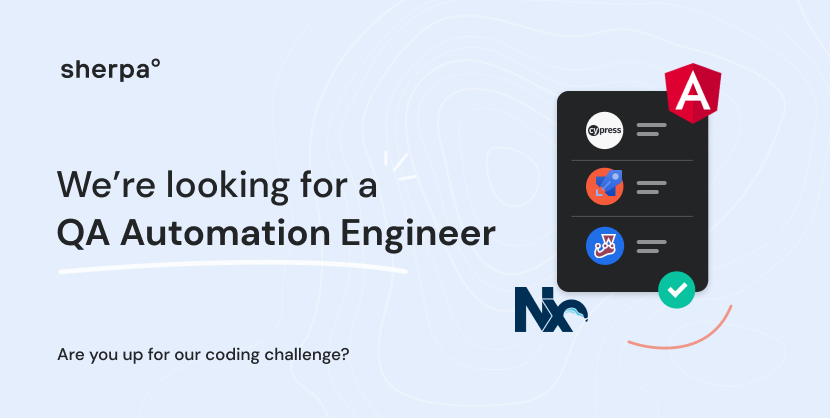

# Join sherpa° - the coding challenge
Find out more about sherpa° at our [careers page](https://joinsherpa.com/careers).

Looking for a [Backend Engineering](https://github.com/joinsherpa/coding-challenge-backend) role instead?
Looking for a [Frontend Engineering](https://github.com/joinsherpa/coding-challenge-frontend) role instead?

## Introduction

Hi! If you're reading this then it's because you're in the interview process with us at sherpa° and have been invited to
complete the coding challenge as a **QA Automation Engineer**. Congratulations! 🎉

This coding challenge is designed to assess your ability to write code while giving you the freedom to express yourself and show off
what you consider to be best practices.

## Setup

This repository contains a sekelton of a basic Cypress test suite in TypeScript. The code here was build for node version 14.

The first step is to run `npm i` to install the required dependencies.

A handful of scripts are provided:

`npm run test` will run a cypress test suite headless

`npm run test-ui` will run a cypress test suite and open up cypress in the browser

## The scenario

The product team has a created a brand new application to help travellers find the right information for their next trip. You are tasked to create the first end-to-end test suite for the application and set the stage for adding more in the future.

### Manual test

So far the team has been following these steps to manually test if the application is working as expected and if it can be released into production.
Currently the application in in a user acceptance environment called `Sandbox`.

Steps for manual testing:
1. Navigate to [Trip Element in sandbox](https://apps-sandbox.joinsherpa.io/trip?appId=sxgyNDA1Mz) in your favorite browser.
2. Make sure to verify the Trip Element has loaded in the browser.
3. Search a trip from `Germany` to `Canada` as a fully vaccinated traveler.
   * Expand on any section e.g. document required section.
   * Verify if what you see is helpful for travellers e.g. Verify ArriveCAN online [link](https://www.canada.ca/en/public-health/services/diseases/coronavirus-disease-covid-19/arrivecan.html).
4. Switch to "Not vaccinated".
   * Verify if information changed e.g. Verify quarantine information.
5. Search a trip with future date (2 days later).

### Automation test

Here is your starting point:

1. Navigate to `cypress/integration/test.ts`.
2. Write test cases to cover the manual steps above (1 to 5).

Note1: Don't worry about navigating to the Sherpa url, the Cypress is setup to start there.
Note2: Cypress uses electron browser by default. If you wish to run it in any other browser, feel free to do so!

> Keep in mind, the data you're testing against can change several times a day, what you're looking at now might change tomorrow! 

# Tips

Because the slate is blank, you will be making a lot of decisions about how the test should work, it's a good idea to document these decisions, as you will very likely be asked about them in the follow-up.

The functional requirements here should probably take no longer than a couple of hours to implement. The standard you should be aiming for is something you would submit as a pull request for a production ready test suite. Keep in mind, quality over quantity. If you don't get to a complete solution, that's fine as long as you can highlight your approach and showcase quality code.

A few tips with Cypress:
1. You can run the test via `npm run test` command
2. If you prefer using a UI, use `npx run test-ui`, and then choose `test` to run in a browser.

# Submission
Once you're comfortable with sharing your code provide either a link to your repository or package it up into a `zip` file and send it to `alex@joinsherpa.com`.
We love using GitHub, if you are using private repository you can also send an invite to [alx-andru](https://github.com/alx-andru) or fork this repo and open a PR with your changes!

# FAQ
I have not been invited for a coding challenge, can I still submit?
> Absolutely! We are looking for folks who are just as passionate about building products for a global audience as we are. Submit your solution and we'll be in touch! Chances are you'll be able to go through our interview process and join sherpa°! 

I've spent too much time and can't complete the challenge, will I loose the opportunity to get a job?
> As a reminder, quality over quantity. If you don't get to a complete solution, that's fine as long as you can highlight your approach and showcase quality code. Pick one endpoint and see if you can get it to work.

Can I use a different tech stack?
> You have the freedom to use different frameworks and libraries but `Typescript` remains a hard requirement as it is our primary programming language and you'll be working with it every day.

I'm new to Cypress, can I use something else instead?
> We are looking for people who are familiar with Cypress and have a solid understanding of the concepts. The boilerplate provided should get you started right away without having to worry about an initial setup. If you're new to Cypress take it as a great opportunity to learn more and focus only on a small portion of the challenge. At the end of the day you'll be using Cypress on a daily basis once you join sherpa°.

